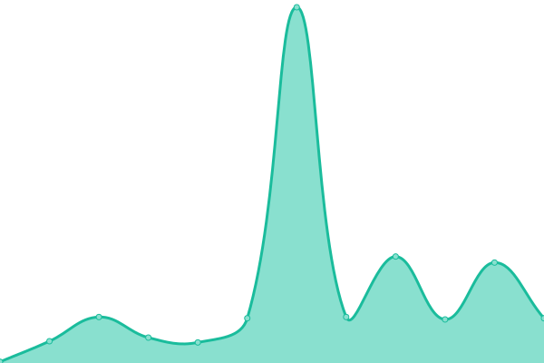

# [📈 Live Status](https://rit-rc.github.io/rc-status-page/): <!--live status--> **🟩 All systems operational**

This repository contains the open-source uptime monitor and status page for [RIT Research Computing](https://rit-rc.github.io/rc-status-page/), powered by [Upptime](https://github.com/upptime/upptime).

With [Upptime](https://upptime.js.org), you can get your own unlimited and free uptime monitor and status page, powered entirely by a GitHub repository. We use [Issues](https://github.com/upptime/upptime/issues) as incident reports, [Actions](https://github.com/RIT-RC/rc-status-page/actions) as uptime monitors, and [Pages](https://upptime.github.io/upptime) for the status page.

<!--start: status pages-->
<!-- This summary is generated by Upptime (https://github.com/upptime/upptime) -->
<!-- Do not edit this manually, your changes will be overwritten -->
<!-- prettier-ignore -->
| URL | Status | History | Response Time | Uptime |
| --- | ------ | ------- | ------------- | ------ |
|  RC Website | 🟩 Up | [rc-website.yml](https://github.com/RIT-RC/rc-status-page/commits/HEAD/history/rc-website.yml) | 

 294ms
     
 | 

<a href="https://RIT-RC.github.io/rc-status-page/history/rc-website">100.00%</a>
    

|  SPORC-Cluster | 🟩 Up | [sporc-cluster.yml](https://github.com/RIT-RC/rc-status-page/commits/HEAD/history/sporc-cluster.yml) | 

 37ms
     
 | 

<a href="https://RIT-RC.github.io/rc-status-page/history/sporc-cluster">100.00%</a>
    

|  KGCOE-GitLab | 🟩 Up | [kgcoe-git-lab.yml](https://github.com/RIT-RC/rc-status-page/commits/HEAD/history/kgcoe-git-lab.yml) | 

 38ms
     
 | 

<a href="https://RIT-RC.github.io/rc-status-page/history/kgcoe-git-lab">100.00%</a>
    

|  Mirrors | 🟩 Up | [mirrors.yml](https://github.com/RIT-RC/rc-status-page/commits/HEAD/history/mirrors.yml) | 

 234ms
     
 | 

<a href="https://RIT-RC.github.io/rc-status-page/history/mirrors">100.00%</a>
    

|  RC Documentation | 🟩 Up | [rc-documentation.yml](https://github.com/RIT-RC/rc-status-page/commits/HEAD/history/rc-documentation.yml) | 

 1091ms
     
 | 

<a href="https://RIT-RC.github.io/rc-status-page/history/rc-documentation">99.78%</a>
    

|  Open OnDemand | 🟩 Up | [open-on-demand.yml](https://github.com/RIT-RC/rc-status-page/commits/HEAD/history/open-on-demand.yml) | 

 38ms
     
 | 

<a href="https://RIT-RC.github.io/rc-status-page/history/open-on-demand">100.00%</a>
    

|  RC Ticketing | 🟩 Up | [rc-ticketing.yml](https://github.com/RIT-RC/rc-status-page/commits/HEAD/history/rc-ticketing.yml) | 

 254ms
     
 | 

<a href="https://RIT-RC.github.io/rc-status-page/history/rc-ticketing">100.00%</a>
    

|  Grafana | 🟩 Up | [grafana.yml](https://github.com/RIT-RC/rc-status-page/commits/HEAD/history/grafana.yml) | 

 43ms
     
 | 

<a href="https://RIT-RC.github.io/rc-status-page/history/grafana">99.85%</a>
    

|  Virtualization | 🟩 Up | [virtualization.yml](https://github.com/RIT-RC/rc-status-page/commits/HEAD/history/virtualization.yml) | 

 38ms
     
 | 

<a href="https://RIT-RC.github.io/rc-status-page/history/virtualization">100.00%</a>
    

|  RC File Hosting | 🟩 Up | [rc-file-hosting.yml](https://github.com/RIT-RC/rc-status-page/commits/HEAD/history/rc-file-hosting.yml) | 

 204ms
     
 | 

<a href="https://RIT-RC.github.io/rc-status-page/history/rc-file-hosting">100.00%</a>
    

<!--end: status pages-->

[**Visit our status website →**](<[https://upptime.github.io/upptime](https://rit-rc.github.io/rc-status-page/)>)

## 📄 License

- Powered by: [Upptime](https://github.com/upptime/upptime)
- Code: [MIT](./LICENSE) © [Upptime](https://upptime.js.org)
- Data in the `./history` directory: [Open Database License](https://opendatacommons.org/licenses/odbl/1-0/)
